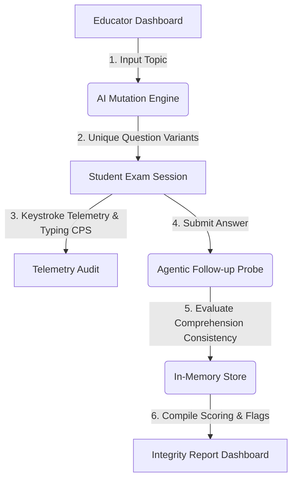

# ExamGuard AI
> Rebuilding credential trust infrastructure for the age of AI.

Traditional remote proctoring systems focus on surveillance and camera monitoring, which builds resentment and fails to stop AI. ExamGuard AI stops cheating by designing exams that are structurally resistant to AI assistance in the first place — combining question mutation, agentic verification, and privacy-first behavioral telemetry.

---

## 💡 The Core Pillars



### 1. AI Question Mutation
Instead of distributing static exams, ExamGuard AI uses Google Gemini to mutate a single topic into multiple conceptually equivalent but structurally and textually unique variants. Answers cannot be shared or reused because no two students receive the same exam paper.

### 2. Agentic Comprehension Probing
After submitting an answer, the student faces an unexpected follow-up micro-question from an AI agent. While an AI tool can output a static response, it cannot simulate a student's live, consistent conceptual reasoning. Any contradiction between the original answer and the follow-up response exposes copy-paste or AI usage.

### 3. Behavioural Telemetry
The system passively monitors typing speeds, clipboard paste events, and keystroke timing spikes. This creates an objective integrity fingerprint without invasive camera surveillance. For instance, inputting 2,000 characters in 3 seconds is flagged as a paste event.

---

## 🛠️ Technology Stack
- **Framework**: Next.js 16 (App Router)
- **Language**: TypeScript
- **AI Core**: Google Gemini Pro via `@google/generative-ai`
- **Styling**: Tailwind CSS
- **Session Layer**: Ephemeral In-Memory session map

---

## ⚙️ Local Setup

### 1. Prerequisites
Ensure you have Node.js (v18+) installed on your machine.

### 2. Installation
Clone this repository and install the dependencies:
```bash
npm install
```

### 3. Environment Variable Setup
Create a `.env.local` file in the root directory:
```bash
cp .env.example .env.local
```
Open `.env.local` and configure your Google Gemini API key:
```env
GEMINI_API_KEY=your_actual_gemini_api_key
```

### 4. Running the Development Server
Start the Next.js local server:
```bash
npm run dev
```
Open [http://localhost:3000](http://localhost:3000) in your browser.

---

## 📋 Demo Walkthrough Script (For Judges)

Follow this end-to-end path to demonstrate the three core outcomes of the platform:

### Step 1: Educator Exam Setup (`/educator`)
1. Enter a topic (e.g. `"Newton's Third Law of Motion"`).
2. Set "Number of Students" to `2` and "Difficulty Level" to `Applied`.
3. Click **Generate Exam**.
4. Observe the **first wow moment**: Gemini generates structurally unique questions for Student A and Student B testing the exact same conceptual rubric.
5. Copy the generated link for **Student A** and open it in a new window.

### Step 2: Student Test Administration (`/exam/[sessionId]`)
1. On the student exam client, note that the timer is running and keystrokes are tracked silently.
2. **Scenario A (AI-assisted / Cheating simulation)**:
   - Copy a pre-written or AI-generated answer.
   - Paste it directly into the answer area. (This triggers the paste telemetry flag and the typing speed anomaly).
   - Click **Submit Answer**.
3. **The Agentic Probing Moment**:
   - The UI displays an unexpected follow-up probe: *"One quick follow-up on your answer..."*
   - Type a brief, incoherent, or contradictory explanation (e.g., *"I don't know, it's just action-reaction"*).
   - Click **Submit Follow-up**.
4. Complete any remaining questions and click **View Report**.

### Step 3: Educator Audit Review (`/report/[sessionId]`)
1. Inspect the **Hero Risk Gauge** displaying the high-risk score colored in Rose/Red.
2. Read the **AI Integrity Narrative Summary** highlighting the timing anomaly, paste event, and follow-up contradiction.
3. Scroll down and expand the question details card to view:
   - The side-by-side comparison showing the long original answer and the incoherent follow-up answer.
   - The telemetry stats box showing the high `CPS` (Characters Per Second) typing speed and the `1 paste` flag.
   - The AI Verdict badge (`likely_assisted`) and the detailed Gemini verdict analysis showing why the student's follow-up explanation failed to align with their original response.
